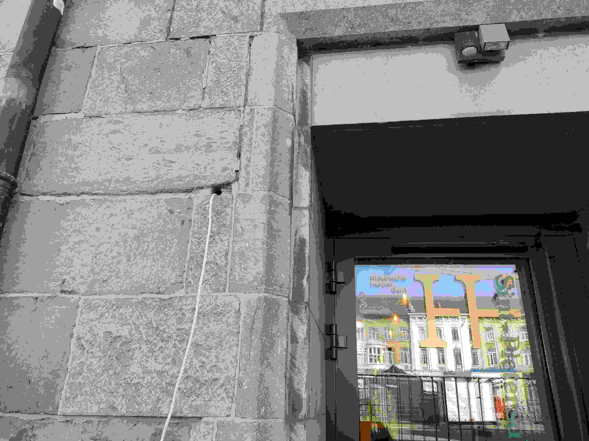
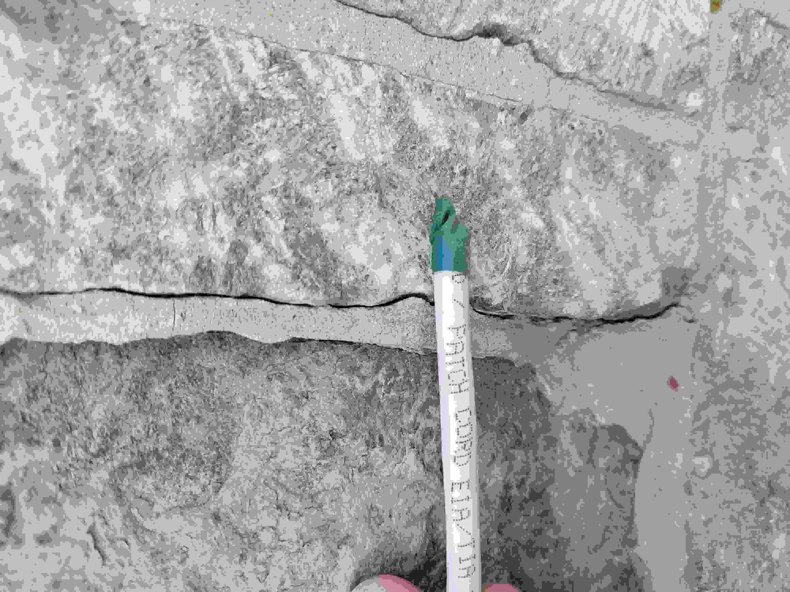
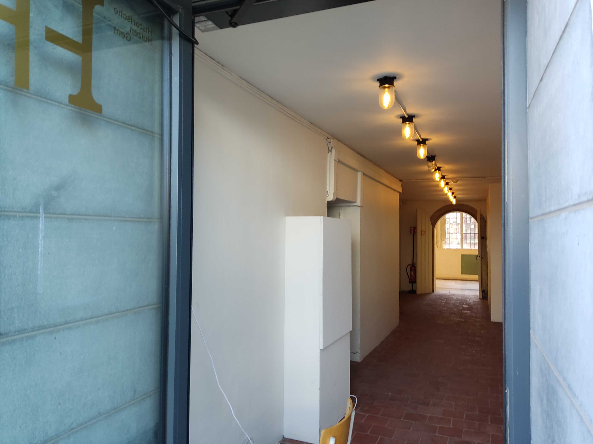
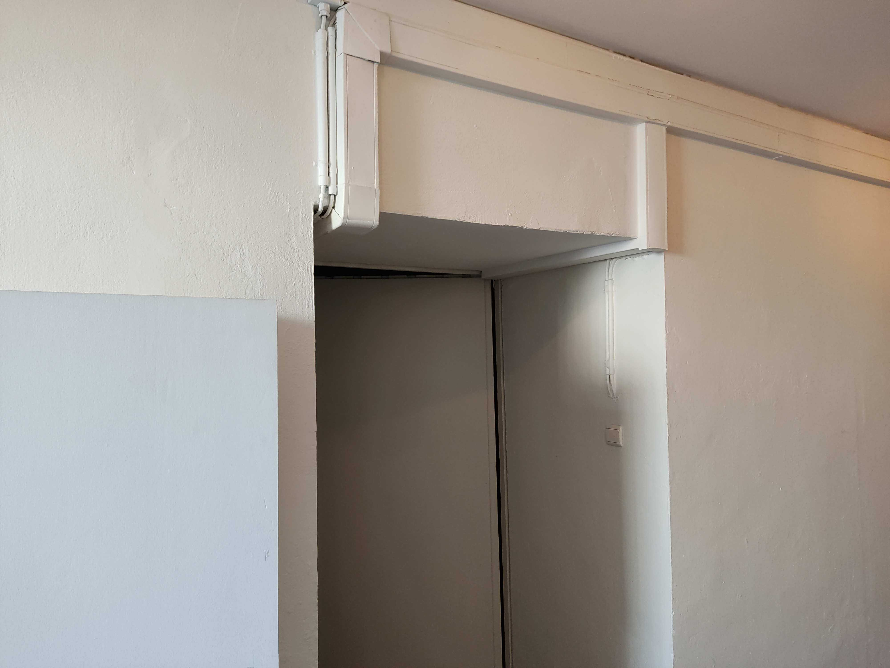
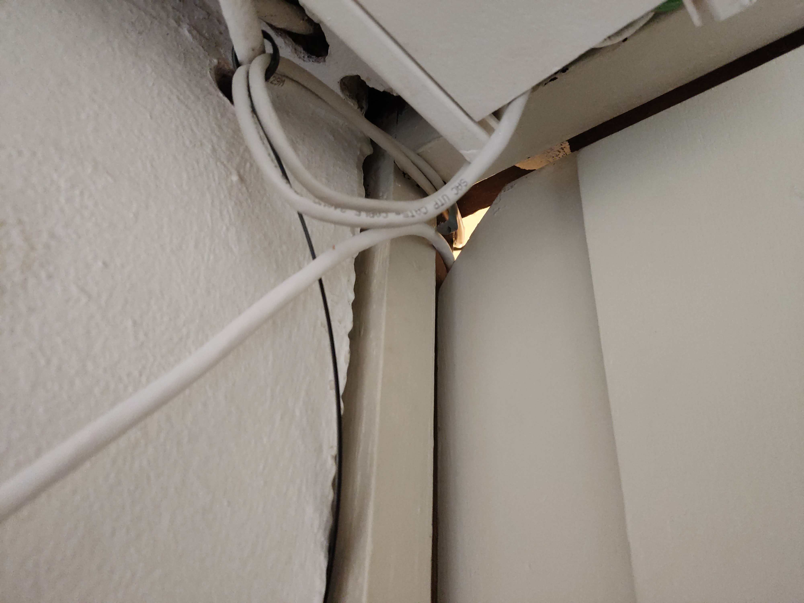
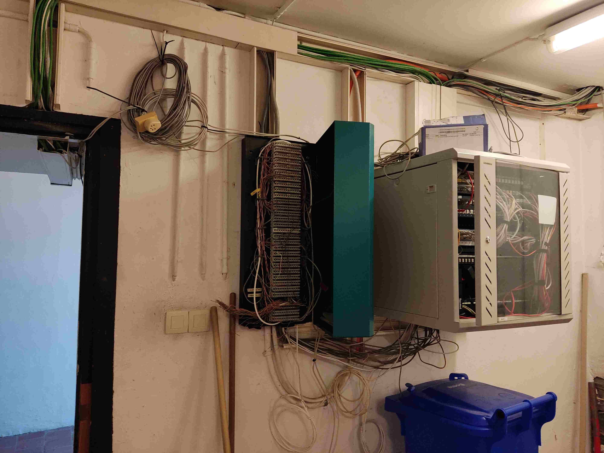
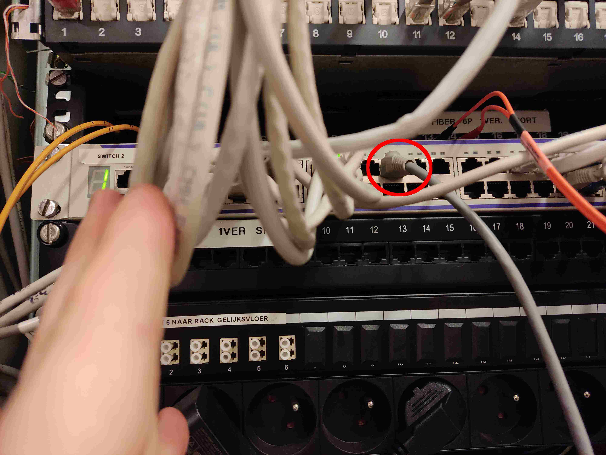

# Abdij

Internet komt van de abdij (<https://www.openstreetmap.org/relation/2804440>). Je moet hiervoor op voorhand een mail sturen naar <jurgen.vangeert@district09.gent> (dit is nu district09, niet meer digipolis).

- [Mail from apr. 2019 to get access](./mail.txt)

Neem ook contact op met de abdij zelf, want district09 doet dit niet altijd. Het gebouw is gesloten op maandag.

Steek de kabel door het gat in de muur. Dit doe je door het einde van de kabel te tapen met elektische tape (zodat die niet vastraakt in de muur) en die dan dan al draaiend van binnen naar buiten te duwen. Binnen heb je 10 meter nodig (dit is met marge) om naar de switch te raken. 

Je zal aan de balie moeten vragen om de deur te openen van de stockage, hier staat de switch.

Er is een hoekje uit de deur waarlangs je de kabel kan steken.

Plug hier in poort 19 van switch 2 (controleer dat dit hetzelfde gebleven is). Normaal krijg je dan via DHCP een privaat IP, maar als je dit vraagt, kan je ook een publiek IP krijgen (dit moet je dan zelf statisch instellen).

Eenmaal je kabel uit de muur is, heb je een aantal opties:

- je kan die met een hoogtewerker tot het dak trekken, en dan van daar naar de IT-container (hoog genoeg boven het parcours)
- je kan een straler (nanostation M5, lenen van Student Kick-Off) hoog genoeg boven de hekkens hangen aan de abdij (of stellingen ernaast) en die laten stralen naar de container. Vergeet dan geen PoE injector te steken aan de kant van de netwerkkast zodat de straler stroom heeft. Controleer dat je ongeveer line of sight hebt.
