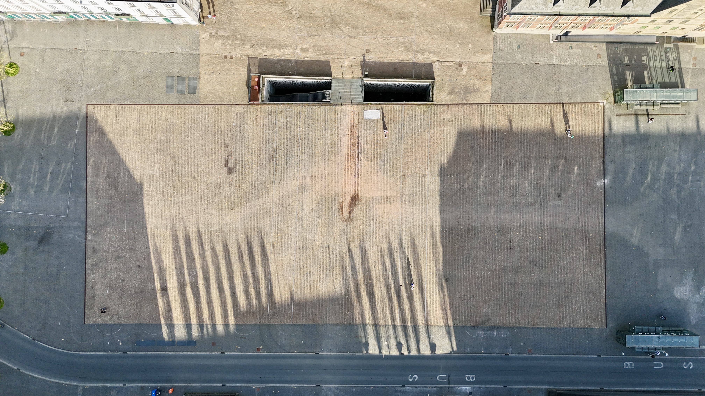
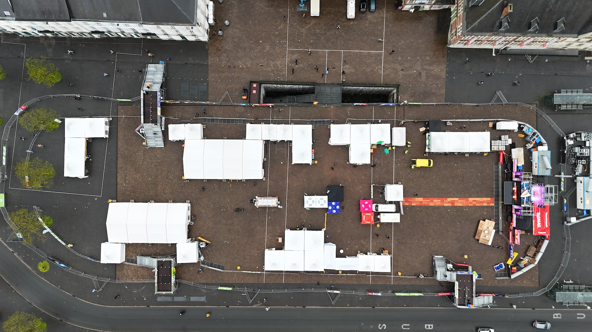
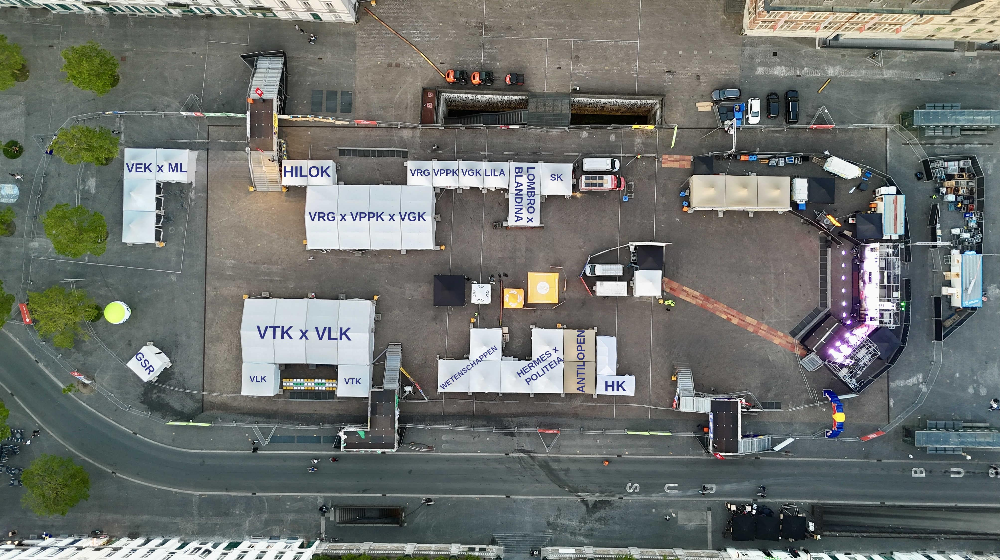

# Terrain

The event is held on the [Sint-Pietersplein](https://visit.gent.be/nl/zien-doen/sint-pietersplein) in Ghent. A hotspot for all students studying in the city.

The setup is mostly the same every year but make sure to get the latest information for the current edition.

## 12UL 2019

[Inplanting 12UL 2019 V2.pdf](18-19/Inplanting 12UL 2019 V2.pdf)

# 12UL 2024

Drone view:

# 12UL 2025

Drone view:

# 12UL 2026

[Inplanting-12UL-2026-V4.pdf](25-26/12urenloop/Inplanting-12UL-2026-V4.pdf)
>>>>>>> Stashed changes
